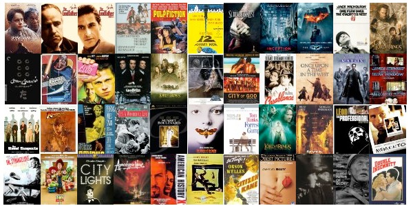

```{r setup, echo=FALSE, results='hide', message=FALSE, warning=FALSE}
# Če želimo nastaviti pisave v PDF-ju, odkomentiramo
# in sledimo navodilom v programu.
#source("fontconfig.r", encoding="UTF-8")

# Uvoz vseh potrebnih knjižnic
source("lib/libraries.r", encoding="UTF-8")
```

```{r rstudio, echo=FALSE, results='asis'}
# Izris povezave do RStudia na Binderju
source("lib/rstudio.r", encoding="UTF-8")
```

# Izbira teme

Za projektno nalogo pri APPR bom analizirala najboljših 250 filmov po IMDb lestvici. Pri projektu bom gledala leto izdaje, zvrst, proračun, donosnost, oceno, dolžino, jezik, državo snemanja, ...
Cilj mojega projekta je ugotoviti katere komponente najbolj vplivajo na priljubljenost filma.




vir: `https://exstreamist.com/imdb-top-250-movies-streaming-on-netflix-updated-monthly/`

***

# Obdelava, uvoz in čiščenje podatkov

```{r uvoz, echo=FALSE, message=FALSE, warning=FALSE}
source("uvoz/uvoz.r", encoding="UTF-8")
```

Uvozili smo podatke o filmih v obliki CSV s spletnih strani Kaggle in data.world ter v obliki HTML s IMDB spletne strani. Podatki so shranjenu v štirih razpredelnicah v obliki *tidy data*.

1. tabela:
  - `Title` - naslov fima
  - `Year` - spremenljivka: leto izdaje filma,
  - `Runtime` - meritev: dolžina filma,
  - `imdbRating` - meritev: ocena filma,
  - `imdbID` - spemenljivka: številka filma, 
  - `Production` - spremenljivka: filmski studio, ki je film izdal,
  - `Budget` - meritev: proračun za film,
  - `Gross` - meritev: donosnost filma v milijonih.
  
2. tabela:
  - `Title` - naslov fima
  - `Country` - spremenljivka: država snemanja filma.

3. tabela:
  - `Title` - naslov fima
  - `Genre` - spremenljivka: zvrst filma.

4. tabela:
  - `Title` - naslov fima
  - `Language` - spremenljivka: govoreči jeziki v filmu.

***

# Analiza in vizualizacija podatkov
```{r vizualizacija, echo=FALSE, message=FALSE, warning=FALSE, results='hide'}
source("vizualizacija/vizualizacija.r", encoding="UTF-8")
```


Spodnji zemljevid prikazuje države v katerih so bili filmi snemani in koliko jih je bilo posnetih v posamezni državi.
V sivo obrarvanih državah ni bilo posnetega nobenega filma.
Kot po pričakovanjih, je bilo največ filmiv posnetih v ZDA, drugo največ pa v Veliki Britaniji. Zanimivo je, da je v večih evropskih državah bil posnet vsaj en film, medtem ko jih v Južni Ameriki ni bilo posnetih nič in le nekaj v Afriki in Aziji.

```{r zemljevid, echo=FALSE, fig.align='center', fig.cap='Zmeljevid držav snemanja filmov', warning=FALSE}
c
``` 


Graf, ki prikazuje povezave med oceno filma, proračunom in dolžino.
Večina filmov je dolga okoli 100 min. Film z največjih dobičkom ter film z najboljšo oceno pa sta oba dolga okoli 150 min.
Razberemo lahko, da donosnost filma ni nujno odvisna od dolžine ali ocene. Med filmi z najnižim dobičkom imamo filme vseh dolžin, od najkrajših do najdaljših. Prav tako je med nijimi nekaj najbolje ocenjenih filmov in veliko filmov z oceno nižjo od 8,5.

```{r graf1, echo=FALSE, fig.align='center', message=FALSE, warning=FALSE, fig.cap='Graf proračuna, dolžine in ocene filma'}
graf1
```

Spodnji graf prikazuje število filmov, posnetih v posameznem letu.
Vidimo lahko, da je med top250 zelo veliko filmov, ki so bili posneti v zadnjih 20 letih. Največ pa jih je bilo posnetih v letu 1995.

```{r graf2, echo=FALSE, fig.align='center', message=FALSE, warning=FALSE, fig.cap='Graf posnetih filmov po letih'}
graf2
```


Vsaka točka v naslednjem grafu prikazuje zvrst filma, leto, v katerem je bil posnet, ter oceno. Prikazanih je samo šest najbolje zastopanih zvrsti.
Jasno razvidno je, da je drama najbolj popularna zvrst, veliko pa je tudi trilerjev. Med rezultati pa je zlo malo akcijskih filmov ter kriminalk.


```{r graf3, echo=FALSE, fig.align='center', message=FALSE, warning=FALSE, fig.cap='Graf zvrsti, ocene in leta izdaje'}
graf3
```


Spodnji graf prikazuje filme, ki pripadajo filskim studijem, ki so posneli vsaj 15 filmov od najboljših 250. 
Zanimivo je, da je film z največjim proračunom izdal 20th Century Fox, med tem ko so imeli vsi ostali filmi posneti v tem studiju dokaj majhen proračun.  Najbolje ocenjen film je bil posnet v studijih Paramount Pictures, prav tako pa ima tudi enega manjših proračunov.
Vidimo lahko, da imajo vsi filmi United Artists nižji proračun ter približno enako oceno.

```{r graf4, echo=FALSE, fig.align='center', message=FALSE, warning=FALSE, fig.cap='Graf ocene, proračuna in filskih studijev'}
graf4
```

Iz naslednjega grafa lahko razberemo zastopanost govorečih jezikov v najboljših 250 filmih.
Ni presenetljivo, da je angleščina najpogosteje govorjen jezik v najboljših 250 filmih.
Med ostalimi jeziki se največkrat pojavijo še francoščina, nemščina, španščina in italijanščina.
```{r graf5, echo=FALSE, fig.align='center', message=FALSE, warning=FALSE, fig.cap='Graf govorečih jezikov v filmih'}
graf5
```

***
# Napredna analiza podatkov
```{r analiza, echo=FALSE, message=FALSE, warning=FALSE, results='hide'}
source("analiza/analiza.r", encoding="UTF-8")
```
Spodnji graf prikazuje povezavo med prihodkom in proračunom za najboljših 100 filmov.

```{r analiza1, echo=FALSE, fig.align='center', message=FALSE, warning=FALSE, fig.cap='Graf prihodkov in proračuna'}
analiza1  
```

***

```{r shiny, echo=FALSE}
shinyAppDir("shiny", options=list(width="100%", height=600))
```
